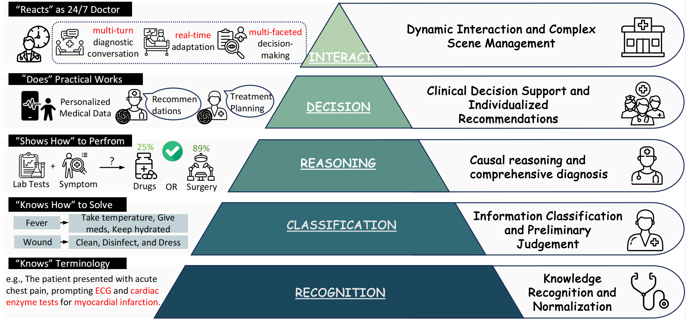

<h1 align = "center">

<em>Aligning Clinical Needs and AI Capabilities</em>:  A Survey on LLMs for Medical Reasoning
</h1>

<div align="center">
Qi Peng<sup>13</sup>, Jiatong Li<sup>1</sup>, Sirui Huang<sup>1</sup>, Yiyang Jiang<sup>1</sup>, Kaisong Gong<sup>2</sup>, Ronger Ding<sup>3</sup>, Shijie Ye<sup>4</sup>, 

Changmeng Zheng<sup>1</sup>, Xiao-Yong Wei<sup>1</sup>, Qing Li<sup>1</sup>
<br><br>
<sup>1</sup>Hong Kong Polytechnic University,
<sup>2</sup>Hong Kong University,
<sup>3</sup>South China University of  Technology,
<sup>4</sup>University of Toronto

<a href='https://arxiv.org/abs/2502.09838'></a> 
</div>

# 🚀 Awesome-LLM-Reasoning-on-Medicine 



# 🔔 News

- ✨ [2025-09-23] The repository is created to maintain the resources for our paper. 

- 🍺 [2025-09-15] Our survey is released on TechRxiv: [Aligning Clinical Needs and AI Capabilities: A Survey on LLMs for Medical Reasoning](https://www.techrxiv.org/doi/full/10.36227/techrxiv.175790907.73315176/v1)


# 🌟 About This Repo
Large language models (LLMs) have emerged as important tools in healthcare, showing growing potential for clinical reasoning and patient care. This survey examines recent progress in medical LLMs, focusing on reasoning applications and requirements. We present a dual-view approach that connects clinical practice with computational methods. On the clinical side, we establish a five-level competency scheme following Miller's Pyramid, progressing from knowledge recall to dynamic case management. On the computational side, we link deductive, inductive, and abductive reasoning patterns to common medical goals and tasks. We also introduce a benchmark dataset spanning five levels of medical reasoning capability and report results on 18 state-of-the-art models, revealing that medical specialist models excel in diagnosis-centric tasks while general models lead in decision support and dialogue. We conclude by discussing current progress and open challenges, including data limitations, hallucination, and grounding issues, and outline directions toward safer, more reliable, and workflow-ready systems.


This repository contains resources and references for our survey paper: 

🔥 [Aligning Clinical Needs and AI Capabilities: A Survey on LLMs for Medical Reasoning](https://www.techrxiv.org/doi/full/10.36227/techrxiv.175790907.73315176/v1)

We will update the repository and our paper. Welcome to discuss and contribute!

### 📝 Citation

```python
@article{Peng_2025,
  title={Aligning Clinical Needs and AI Capabilities: A Survey on LLMs for Medical Reasoning},
  url={http://dx.doi.org/10.36227/techrxiv.175790907.73315176/v1},
  DOI={10.36227/techrxiv.175790907.73315176/v1},
  publisher={Institute of Electrical and Electronics Engineers (IEEE)},
  author={Peng, Qi and Li, Jiatong and Huang, Sirui and Jiang, Yiyang and Gong, Kaisong and Ding, Ronger and Ye, Shijie and Zheng, Changmeng and Wei, Xiao-Yong and Li, Qing},
  year={2025},
  month=sep
}
```


## 📖 Overview

- [🚀 Awesome-LLM Reasoning on Medicine](#Awesome-LLM-Reasoning-on-Medicine)
  - [🔔 News](#-news)
  - [ 🌟 About This Repo](#about-this-repo)
  - [ 📚 Dataset Resource](#dataset-resource)
  - [🤖 Model List](#model-list)
    - [CoT](#cot)
    - [Long CoT](#long-cot)
    - [Search](#search)
    - [MLLMs](#mllms)
    - [RAG](#rag)
    - [Agent](#agent)

## 📚 Dataset Resource

|  Dataset   |  Modality   |  Task Type  |   Number of Samples |  Answer Form   |   Language  |
| :--------: |  :-------:  |   :---:     |  :-------------:    |  :------:      | :------:    |
| [CADEC](https://data.csiro.au/collection/csiro:10948) | Txt | NER, RE | ~1,250 posts | Free-Form | English |
| [UMLS](https://catalog.data.gov/dataset/unified-medical-language-system-umls-a4a04) | Txt | NER, RE | -- | Free-Form | English |
| [MedNorm](https://www.kaggle.com/datasets/saurabhshahane/mednorm) | Txt | NER,<br>Concept normalization | 27,979 descriptions | Free-Form | English |
| [CBLUE](https://github.com/CBLUEbenchmark/CBLUE) | Txt | Multi-task NLU | -- | Free-Form / labels | Chinese |
| [NCBI Disease](https://huggingface.co/datasets/ncbi/ncbi_disease) | Txt | Disease NER &<br>Concept Normalization | 793 articles | Span /<br>Concept ID | English |
| [MeDAL](https://www.kaggle.com/datasets/xhlulu/medal-emnlp) | Txt | Abbr. Disambig. | 14,393,619 articles | Open-text / label | English |
| [CASI](https://conservancy.umn.edu/items/6651323b-444a-479e-a41a-abca58c2e721) | Txt | Abbr. Disambig. | 440 abbreviations | Label | English |
| [Clinical-IE](https://huggingface.co/datasets/mitclinicalml/clinical-ie) | Txt | Information Extraction | Depends on<br>subtasks | Span /<br>Structured output | English |
| [OpenFDA](https://open.fda.gov/) | Txt | Regulatory Retrieval | -- | Structured JSON | English |
| [MedDG](https://github.com/lwgkzl/MedDG) | Txt | Dialogue,<br>Respect Generation,<br>Intent Understanding | 17,863 dialogues,<br>308,953 utterances | Open | Chinese |
| [CMID](https://github.com/IMU-MachineLearningSXD/CMID) | Txt | Intent Understanding | ~1.2K dialogues | Open | Chinese |
| [Emergency<br>Service Triage Application](https://www.kaggle.com/datasets/ilkeryildiz/emergency-service-triage-application) | Tab | Classification | ~12K instances | MC-QA | English |
| [Ddxplus](https://github.com/mila-iqia/ddxplus) | Tab | Symptom Detection | ~1.3M patients | Open | English |
| [MIMIC-IV-Ext DirECT](https://physionet.org/content/mimic-iv-ext-direct/1.0.0/) | Txt | Diagnostic Reasoning | 511 clinical notes | Open | English |
| [Disease Diagnosis](https://www.kaggle.com/datasets/s3programmer/disease-diagnosis-dataset) | Txt | Diagnostic Reasoning | ~2,000<br>instances | Open | English |
| [MC-MED](https://physionet.org/content/mc-med/1.0.0/) | Img,Txt | Prediction | 118,385<br>Visits | Open | English |
| [MIETIC](https://physionet.org/content/mietic/1.0.0/) | Txt | Triage Classification | 9,629 image cases | Gen. | English |
| [Heart Disease Data](https://www.kaggle.com/datasets/johnsmith88/heart-disease-dataset) | Txt | Prediction | 303 instances | Open | English |
| [CDSL](https://physionet.org/content/covid-data-shared-learning/1.0.0/) | Txt | Prediction | 4,479 patients | Open | English |
| [OCT](https://www.kaggle.com/datasets/paultimothymooney/kermany2018) | Img | Classification | 84,495 images | Classification | English |
| [ChestX-ray14](https://www.kaggle.com/datasets/nih-chest-xrays/data) | Img | Disease Detection | 112,120 images | Open | English |
| [Diabetic<br>Retinopathy Detection](https://www.kaggle.com/c/diabetic-retinopathy-detection/data) | Img | Classification | ~35,000<br>images | Classification | English |
| [RSNA<br>Pneumonia Detection](https://www.kaggle.com/c/rsna-pneumonia-detection-challenge/data) | Img | Detection | ~30,000<br>images | Open | English |
| [SLAKE](https://huggingface.co/datasets/BoKelvin/SLAKE) | Img, Txt | QA | 14,036 QA pairs | Open | EN & CN |
| [VQA-RAD](https://huggingface.co/datasets/flaviagiammarino/vqa-rad) | Img, Txt | QA | 315 images<br>3,5K QA pairs | Open | English |
| [PATHVQA](https://huggingface.co/datasets/flaviagiammarino/path-vqa) | Img, Txt | QA | 4,999 images<br>32,799 QA pairs | Open | English |
| [MIT-BIH](https://www.physionet.org/content/mitdb/1.0.0/) | Txt | Detection | 48 instances | Classification | English |
| [emrKBQA](https://github.com/panushri25/emrQA) | Txt | QA | 940K question | Open | English |
| [MedDQA](https://github.com/alipay/RJU_Ant_QA) | Txt | QA | 2000 images | MC-QA | Chinese |
| [emrQA](https://github.com/panushri25/emrQA) | Txt | QA | 1,957,835 QA pairs,<br>1,225,369 QA pairs | Open | English |
| [MedAgentsBench](https://github.com/gersteinlab/medagents-benchmark) | Txt | QA | seven established<br>medical datasets | Free-Form | English |
| [ReasonMed](https://github.com/YuSun-Work/ReasonMed) | Txt | QA | 370K examples | Free-Form | English |
| [DrugBank](https://www.drugbank.com/datasets) | Txt | Information Extraction | 10,794 drugs, 1,413,413<br>drug-drug interactions | Free-Form | English |
| [PharmGKB](https://www.clinpgx.org/downloads) | Txt | Relation Extraction | -- | Free-Form | English |
| [RxNorm](https://www.kaggle.com/datasets/nlm-nih/nlm-rxnorm) | Txt | Drug Normalization | >100K concepts | Free-Form | English |
| [Lung Cancer Data](https://archive.ics.uci.edu/dataset/62/lung+cancer) | Txt | Survival Prediction | 52<br>instances | Open | English |
| [Kaggle Diabetes<br>Prediction Dataset](https://www.kaggle.com/datasets/uciml/pima-indians-diabetes-database) | Txt | Prediction | 768<br>instances | Open | English |
| [Hospital Length<br>of Stay Dataset](https://www.kaggle.com/datasets/aayushchou/hospital-length-of-stay-dataset-microsoft) | Txt | Prediction | >100K<br>instances | Open | English |
| [Diabetes 130-US<br>Hospitals (1999-2008)](https://www.kaggle.com/datasets/brandao/diabetes) | Txt | Classification | 101,766<br>patient records | Open | English |
| [CLIP](https://physionet.org/content/mimic-iii-clinical-action/1.0.0/) | Txt | Multi-aspect extractive<br>summarization | 718 discharge | Free-Form | English |
| [Med-QuAD](https://www.kaggle.com/datasets/pythonafroz/medquad-medical-question-answer-for-ai-research) | Txt | QA | ~47K QA pairs | Open | English |
| [MedQA](https://github.com/jind11/MedQA) | Txt | QA | 61,097 questions | MC-QA | EN & CN |
| [MedMCQA](https://huggingface.co/datasets/openlifescienceai/medmcqa) | Txt | QA | ~194K questions | MC-QA | English |
| [PubMedQA](https://huggingface.co/datasets/qiaojin/PubMedQA) | Txt | QA | 211.3k QA pairs | Open | English |
| [MultiMedQA](https://huggingface.co/collections/openlifescienceai/multimedqa-66098a5b280539974cefe485) | Txt | QA | ~208k QA pairs | MC-QA | English |
| [HealthBench](https://huggingface.co/datasets/openai/healthbench) | Txt | QA | 5,000 conversations | Free-Form | English |
| [LiveQA](https://github.com/PKU-TANGENT/LiveQA) | Txt | QA | 634 QA pairs | Open | English |
| [MedicationQA](https://huggingface.co/datasets/truehealth/medicationqa) | Txt | QA | 674 QA pairs | Open | English |
| [Chinese Medical<br>Dialogue Model](https://www.kaggle.com/datasets/thedevastator/chinese-medical-dialogue-model) | Txt | Dialogue, QA | ~4K dialogs | Open | Chinese |
| [TCM Pre-trained Dataset](https://huggingface.co/datasets/FreedomIntelligence/TCM-Instruction-Tuning-ShizhenGPT) | Txt | Pretraining | ~100M tokens | Gen. | Chinese |
| [3MDBench](https://github.com/univanxx/3mdbench) | Img, Txt | Dialogue | 3013 cases | Free-Form | English |
| [Discharge-Me](https://stanford-aimi.github.io/discharge-me/) | Txt | Summarization | 109,168 visits | Gen. | English |
| [MedDec](https://physionet.org/content/meddec/1.0.0/) | Txt | Medical Decision<br>Extraction | 451 discharge<br>summaries | Free-Form | English |
| [2012 i2b2 Temporal<br>Relations Dataset](https://www.i2b2.org/NLP/TemporalRelations/) | Txt | Extraction | - | Free-Form | English |
| [DiSCQ](https://physionet.org/content/discq/1.0/) | Txt | QA | 2K+ questions | Free-Form | English |


---

## 🤖 Model-List

### CoT
- [GPT-oss (2025)](https://openai.com/zh-Hant/index/introducing-gpt-oss/) - an open-source large language model designed for flexible deployment, community-driven improvement, and accessible AI innovation.

- [Qwen3 (2025)](https://arxiv.org/abs/2505.09388) - a next-generation open-source LLM family (0.6–235B, dense & MoE) featuring unified reasoning/response modes with adaptive thinking budgets, state-of-the-art performance, and expanded multilingual support across 119 languages.

- [Deepseek-V3 (2025)](https://arxiv.org/html/2412.19437v1) - a 671B-parameter MoE language model (37B active per token) featuring MLA and DeepSeekMoE architectures, auxiliary-loss-free load balancing, and multi-token prediction, delivering state-of-the-art performance with highly efficient and stable training.

- [Kimi-k2 (2025)](https://arxiv.org/abs/2507.20534) - a 1T-parameter MoE LLM (32B active) trained with the MuonClip optimizer for stability and efficiency, achieving state-of-the-art performance among open-source non-thinking models, with exceptional strengths in coding, mathematics, reasoning, and agentic tasks.

- [Med-REFL (2025)](https://arxiv.org/abs/2506.13793) - a self-corrected reflection framework for enhancing medical reasoning in large language models.

- [ChestX-Reasoner (2025)](https://arxiv.org/abs/2504.20930) - a radiology diagnosis multimodal LLM trained with process supervision from clinical reports and evaluated on a new benchmark with reasoning-focused metrics.

- [MedCoT (2024)](https://arxiv.org/abs/2412.13736) - a hierarchical expert verification reasoning framework for improving interpretability and robustness in medical visual question answering.

- [Med-Gemini (2024)](https://arxiv.org/abs/2404.18416) - a family of multimodal medical LLMs leveraging Gemini’s long-context and web-search capabilities to achieve state-of-the-art performance across diverse medical benchmarks.

- [MedQA-OPEN (2024)](https://arxiv.org/abs/2403.04890) - an open-ended medical QA dataset with clinician-approved rationales and a chain-of-thought prompting framework for clinically realistic reasoning.

- [GPT4 (2023)](https://arxiv.org/abs/2303.08774) - a large-scale multimodal Transformer model capable of processing text and images, achieving human-level performance on various professional and academic benchmarks.


### Long CoT

- [Med-U1 (2025)](https://arxiv.org/abs/2506.12307) - a unified framework for robust medical question answering that guides LLMs to generate concise, verifiable reasoning chains across diverse QA formats.

- [o3 & o4-mini (2025)](https://openai.com/zh-Hant/index/introducing-o3-and-o4-mini/) - o3 and o4-mini are compact, efficient LLM variants optimized for faster inference and lower resource usage while maintaining competitive performance.

- [M1 (2025)](https://arxiv.org/abs/2506.13585) - MiniMax-M1 is the first open-weight large-scale hybrid-attention reasoning model supporting 1-million-token context, optimized for long-context tasks and efficient large-scale reinforcement learning.

- [Baichuan-M1 (2025)](https://arxiv.org/abs/2502.12671) - Baichuan-M1 is a family of large language models trained from scratch to balance general reasoning with specialized medical expertise.

- [DeepSeek-R1 (2025)](https://arxiv.org/abs/2501.12948) - DeepSeek-R1-Zero and DeepSeek-R1 are open-source reasoning models trained with large-scale reinforcement learning, demonstrating strong emergent reasoning behaviors and competitive performance with state-of-the-art systems.

- [MedicalGPT (2024)](https://github.com/shibing624/MedicalGPT) - MedicalGPT training medical GPT model with ChatGPT training pipeline, implemantation of Pretraining, Supervised Finetuning, RLHF(Reward Modeling and Reinforcement Learning) and DPO(Direct Preference Optimization).

- [HuatuoGPT-o1 (2024)](https://arxiv.org/abs/2412.18925) - a medical LLM trained with a verifier-guided two-stage pipeline—verifier-guided search for fine-tuning followed by verifier-based reinforcement learning on verifiable medical problems—to substantially improve complex medical reasoning.

- [o1 (2024)](https://arxiv.org/abs/2412.16720) - o1 is a family of OpenAI models centered on enhanced complex reasoning, demonstrating that improved reasoning mechanisms—such as stronger chain-of-thought and search strategies—can significantly boost LLM performance on challenging reasoning tasks.

- [Mistral (2023)](https://arxiv.org/abs/2310.06825) - a 7B-parameter LLM with grouped-query and sliding window attention, delivering superior efficiency and performance over larger Llama models, with both base and instruction-tuned versions released under Apache 2.0.

- [BioGPT (2023)](https://arxiv.org/abs/2210.10341) - a domain-specific generative Transformer pre-trained on large-scale biomedical literature, achieving state-of-the-art results across multiple biomedical NLP tasks and enabling fluent generation for biomedical text understanding and reasoning.

- [HuatuoGPT (2023)](https://arxiv.org/abs/2305.15075) - a medical consultation LLM trained with both ChatGPT-distilled and real-world doctor data, aligned via RLAIF, achieving state-of-the-art performance among open-source models and surpassing its teacher ChatGPT in most evaluations.

- [Med-PaLM 2 (2023)](https://arxiv.org/abs/2305.09617) - Med-PaLM 2 is a medical large language model that combines PaLM 2 improvements, medical domain finetuning, and ensemble refinement strategies to achieve state-of-the-art performance on multiple benchmarks and approach physician-level quality in medical question answering.

- [Med-PaLM (2023)](https://www.nature.com/articles/s41586-023-06291-2) - Med-PaLM is a medical large language model built on PaLM and Flan-PaLM with instruction prompt tuning, achieving state-of-the-art results on MultiMedQA benchmarks while highlighting key gaps compared to clinicians.


### Search

- [AUTOCT (2025)](https://arxiv.org/abs/2506.04293) - AutoCT is a framework for clinical trial outcome prediction that integrates LLM-based reasoning with interpretable feature engineering and Monte Carlo Tree Search, achieving state-of-the-art performance while improving scalability, transparency, and cost-efficiency.

- [Patho-R1 (2025)](https://arxiv.org/abs/2505.11404) - Patho-R1 is a multimodal pathology reasoning model trained through staged pretraining, supervised fine-tuning, and reinforcement learning on expert-informed datasets, achieving strong diagnostic accuracy and reasoning performance across diverse pathology tasks.

- [ClinicalGPT-R1 (2025)](https://arxiv.org/abs/2504.09421) - ClinicalGPT-R1 is a reasoning-enhanced generalist LLM for disease diagnosis, trained on 20,000 real-world clinical records, and demonstrates superior performance to GPT-4o in Chinese and comparable performance to GPT-4 in English on the MedBench-Hard benchmark.

- [MedS3 (2025)](https://arxiv.org/html/2501.12051v1) - MedS3 is a deployable, small-scale medical language model employing a self-evolution paradigm with Monte Carlo Tree Search and reward-guided selection, achieving strong long-chain reasoning performance and surpassing prior open-source models as well as GPT-4o-mini.

### MLLMs

- [Med-Gemma (2025)](https://arxiv.org/abs/2507.05201) - MedGemma is a collection of medical vision-language foundation models built on Gemma 3, demonstrating advanced multimodal medical understanding and reasoning, outperforming similar-sized generative models, and providing a strong foundation for downstream healthcare applications.

- [Med-E2 (2025)](https://arxiv.org/abs/2505.23118) - MedE2 is a two-stage post-training pipeline that elicits and enhances multimodal reasoning in medical models, demonstrating improved performance and robustness across multiple medical multimodal benchmarks.

- [QoQ-Med (2025)](https://arxiv.org/abs/2506.00711) - QoQ-Med-7B/32B is the first open generalist clinical foundation model that jointly reasons over medical images, time-series signals, and text, trained with DRPO to improve diagnostic performance and highlight salient regions, achieving strong multimodal clinical reasoning across nine domains.

- [GMAI-VL-R1 (2025)](https://arxiv.org/abs/2504.01886) - GMAI-VL-R1 is a multimodal medical reasoning model enhanced with reinforcement learning and step-by-step reasoning data synthesis, achieving improved diagnostic accuracy and generalization in medical image diagnosis and visual question answering tasks.

- [Med-R1 (2025)](https://arxiv.org/abs/2503.13939) - Med-R1 is a reinforcement learning–enhanced medical vision-language model that leverages GRPO to improve generalization and reliability across multiple imaging modalities, achieving strong performance and efficiency even compared to much larger baseline models.

- [MedVLM-R1 (2025)](https://arxiv.org/abs/2502.19634) - MedVLM-R1 is a medical vision-language model that generates explicit natural language reasoning via reinforcement learning, achieving higher accuracy and robust out-of-distribution generalization while enhancing transparency and trustworthiness in clinical imaging tasks.

### RAG

- [TAGS (2025)](https://arxiv.org/abs/2505.18283) - TAGS is a test-time framework that combines a generalist and a domain-specific specialist with hierarchical retrieval and reliability scoring, enabling improved zero-shot medical reasoning without model fine-tuning and achieving strong performance across multiple MedQA benchmarks.

- [Open-Medical-R1 (2025)](https://arxiv.org/abs/2504.13950) - This work investigates data selection strategies for Reinforcement Learning with Verified Rewards (RLVR) in medical LLMs, showing that filtered sampling—especially self-filtering with Gemma-3-12b-it—improves reasoning performance while highlighting trade-offs between domain-specific gains and cross-domain robustness.

- [MRD-RAG (2025)](https://arxiv.org/html/2504.07724v1) - MRD-RAG is a multi-round diagnostic retrieval-augmented generation framework that mimics a doctor’s reasoning process, enabling LLMs to conduct accurate multi-turn medical diagnoses and outperform existing single- and multi-round RAG approaches.

- [MedReason (2025)](https://arxiv.org/abs/2504.00993) - MedReason is a large-scale, high-quality medical reasoning dataset that provides verified step-by-step “thinking paths” from clinical knowledge graphs, enabling LLMs to achieve more accurate and explainable medical problem-solving across diverse clinical tasks.

- [MMRAG (2025)](https://arxiv.org/abs/2502.15954) - MMRAG is a multi-mode retrieval-augmented generation framework that improves biomedical in-context learning by integrating random, top, diversity, and class-based example selection, enhancing performance across NER, relation extraction, and text classification tasks.

- [Med-RAG (2025)](https://arxiv.org/abs/2502.04413) - MedRAG is a knowledge-graph-augmented retrieval-generation model for medical diagnosis that integrates hierarchical diagnostic knowledge with EHR retrieval, providing more accurate, specific, and personalized decision support while reducing misdiagnosis.

- [MedBioLM (2025)](https://arxiv.org/abs/2502.03004) - MedBioLM is a domain-adapted biomedical LLM that combines fine-tuning and retrieval-augmented generation to improve reasoning, factual accuracy, and performance on both short- and long-form biomedical question-answering tasks.

- [Med-R2 (2025)](https://arxiv.org/html/2501.11885v3) - Med-R2 is an LLM-based physician framework that follows the Evidence-Based Medicine process, integrating retrieval, evidence selection, and reasoning to enhance medical problem-solving, achieving higher accuracy than standard RAG and fine-tuning approaches without extra training costs.

- [ClinRaGen (2024)](https://arxiv.org/html/2411.07611v1) - ClinRaGen is a multimodal small language model that leverages knowledge-augmented attention and stepwise rationale distillation to generate both textual and time-series clinical rationales from EHRs, enhancing disease diagnosis and bridging the gap between LLMs and SLMs.

- [MMed-RAG (2024)](https://arxiv.org/abs/2410.13085) - MMed-RAG is a versatile multimodal retrieval-augmented generation system that enhances the factuality of medical vision-language models through domain-aware retrieval, adaptive context selection, and preference-based fine-tuning, achieving substantial improvements across medical VQA and report generation tasks.

- [SelfRewardRAG (2024)](https://arxiv.org/abs/2310.11511) - Self-RAG is a retrieval-augmented generation framework that equips LLMs with on-demand retrieval and self-reflection via special tokens, improving factual accuracy, controllability, and performance across open-domain QA, reasoning, and fact verification tasks.

- [Self-BioRAG (2024)](https://arxiv.org/abs/2401.15269) - Self-BioRAG is a biomedical retrieval-augmented generation framework that integrates domain-specific retrieval, explanation generation, and self-reflection to improve LLM performance, achieving a 7.2% average gain over state-of-the-art open-foundation models on biomedical QA tasks.


### Agent

- [SMR-Agents (2025)](https://www.sciencedirect.com/science/article/pii/S0306457325002389) - SMR-Agents is a Med-VQA framework that enhances diagnostic accuracy and interpretability by simulating collaborative reasoning among multiple specialized medical expert agents, combining structured scene understanding with iterative peer-review discussions.

- [MultiMedRes (2025)](https://arxiv.org/abs/2405.11640) - MultiMedRes is a multimodal medical reasoning framework where a learner agent interacts with domain-specific expert models to iteratively acquire and integrate knowledge, achieving state-of-the-art performance in medical multimodal tasks like X-ray visual question answering.

- [Tree-of-Reasoning (2025)](https://arxiv.org/abs/2508.03038) - Tree-of-Reasoning (ToR) is a multi-agent framework that structures medical reasoning in a tree format, tracking evidence and decision paths while using cross-validation among agents to ensure consistent, accurate diagnosis in complex clinical scenarios.

- [AURA (2025)](https://arxiv.org/abs/2507.16940) - AURA is a visual-linguistic agent for medical imaging that leverages LLM-based reasoning to provide interactive, explainable, and clinically aligned analysis of medical images.

- [MedOrch (2025)](https://arxiv.org/abs/2506.00235) - MedOrch is a modular, agent-based medical decision-support framework that orchestrates specialized tools and reasoning agents to provide transparent, multimodal, and clinically verifiable recommendations.

- [MAM (2025)](https://arxiv.org/abs/2506.19835) - MAM (Modular Multi-Agent Framework) is a collaborative, role-based multimodal medical LLM system that decomposes diagnosis into specialized agent roles to improve flexibility, knowledge integration, and diagnostic performance across diverse modalities.

- [TxAgent (2025)](https://arxiv.org/abs/2503.10970) - TxAgent is a multimodal, tool-augmented AI agent for precision therapeutics that combines multi-step reasoning, real-time biomedical knowledge retrieval, and personalized treatment planning.

- [MMedAgent-RL (2025)](https://arxiv.org/abs/2506.00555) - MMedAgent-RL is a reinforcement learning–enhanced multi-agent framework for medical vision-language reasoning that dynamically coordinates multiple specialized medical agents for accurate diagnostics.

- [DoctorAgent-RL (2025)](https://arxiv.org/abs/2505.19630) - DoctorAgent-RL is a reinforcement learning–based multi-agent framework for dynamic, multi-turn medical consultations that enables LLMs to conduct patient interactions with clinical reasoning.

- [MedAgent-Pro (2025)](https://arxiv.org/abs/2503.18968) - MedAgent-Pro is an agentic, multi-modal reasoning framework designed to bring systematic, evidence-based diagnosis to clinical AI.

- [Med-RAX (2025)](https://bowang-lab.github.io/MedRAX/) - MedRAX is a unified AI agent for versatile chest X-ray (CXR) interpretation, designed to bridge the gap between specialized models and real-world clinical workflows.

- [SeM-Agents (2025)](https://arxiv.org/abs/2506.16650) - SeM-Agents is a workflow-based Large Language Model (LLM) framework designed to improve Automated Program Repair (APR) by incorporating deep semantic understanding of issues, code, and execution.

- [HiRMed (2025)](https://arxiv.org/abs/2501.02727) - HiRMed (Hierarchical RAG-enhanced Medical Test Recommendation) is an intelligent medical test recommendation system that integrates Retrieval-Augmented Generation (RAG) with a tree-structured reasoning framework to improve diagnostic guidance.

- [ColaCare (2024)](https://arxiv.org/abs/2410.02551) - ColaCare is a multi-agent framework designed to enhance Electronic Health Record (EHR) modeling and clinical decision support by leveraging Large Language Models (LLMs) in collaboration with domain-specific expert models.

- [DurGagent (2024)](https://arxiv.org/abs/2408.13378) - DrugAgent is a multi-agent Large Language Model (LLM) system designed for drug-target interaction (DTI) prediction with enhanced accuracy, interpretability, and clinical applicability.

- [MMedAgent (2024)](https://arxiv.org/abs/2407.02483) - MMedAgent is the first agentic framework explicitly designed for medical multi-modal reasoning, enabling dynamic tool selection and integration across diverse medical tasks.

- [MEDCO (2024)](https://arxiv.org/abs/2408.12496) - MEDCO is a multi-agent AI copilot for medical education that simulates real-world clinical training by enabling interactive, multi-disciplinary learning through collaboration among patient, doctor, and radiologist agents.

- [ClinicalAgent (2024)](https://arxiv.org/abs/2404.14777) - ClinicalAgent is a multi-agent AI system for clinical trials that enhances LLM reasoning and predictive capabilities by integrating GPT-4 with structured multi-agent workflows, LEAST-TO-MOST decomposition, and ReAct reasoning.

- [MedAide (2024)](https://arxiv.org/abs/2403.00830) - MedAide is an on-device healthcare chatbot that leverages tiny LLMs with optimized edge deployment, LoRA fine-tuning, and RLHF to provide efficient, privacy-preserving medical consultation and preliminary diagnostics in resource-constrained settings.

- [MedAgents (2023)](https://arxiv.org/abs/2311.10537) - MedAgents is a training-free, multi-agent framework that enables collaborative, role-based discussions among LLMs to enhance medical reasoning and decision-making in zero-shot settings across diverse medical benchmarks.

- [MAGDA (2023)](https://arxiv.org/abs/2409.06351) - This work presents a zero-shot, guideline-driven multi-agent LLM framework augmented with contrastive vision-language models that collaboratively analyze medical images, provide chain-of-thought reasoning, and deliver interpretable diagnoses, demonstrating improved performance and adaptability to rare diseases.
